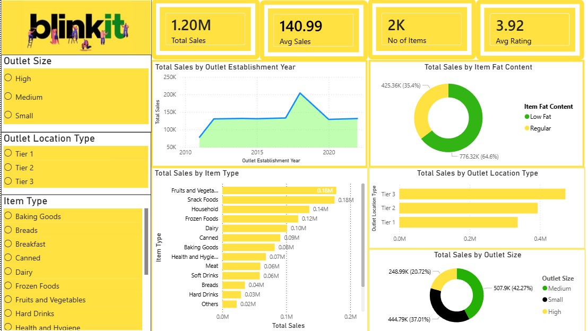

# 📊 Blinkit Sales Dashboard — Power BI


An interactive Power BI dashboard built to analyze Blinkit grocery sales data across outlets, item types, and locations. This project covers the full BI workflow — from raw data cleaning to interactive visual storytelling.

---

## 🖼 Dashboard Preview

> *(Add your dashboard screenshot here after uploading)*



---

## 🎯 Key Insights

| Metric | Value |
|---|---|
| 💰 Total Revenue | $1.20M |
| 🛒 Avg Sale per Item | $140.99 |
| 📦 Total Items | 1,559 |
| ⭐ Avg Customer Rating | 3.92 / 5 |
| 🏆 Top Category | Fruits & Vegetables |
| 📍 Best Performing Tier | Tier 3 |
| 🏪 Best Outlet Size | Medium |

---

## 🛠 Tech Stack

| Tool | Purpose |
|---|---|
| **Power BI Desktop** | Dashboard building & visualization |
| **Power Query** | Data cleaning & ETL |
| **DAX** | Custom measures & KPIs |
| **Microsoft Excel** | Source data format |

---

## 📁 Project Structure

```
blinkit-sales-dashboard-powerbi/
│
├── BlinkIT_Dashboard.pbix        # Main Power BI dashboard file
├── BlinkIT_Grocery_Data.xlsx     # Source dataset
├── dashboard_preview.png         # Dashboard screenshot
└── README.md                     # Project documentation
```

---

## 📊 Dashboard Features

- **KPI Cards** — Total Sales, Avg Sales, No of Items, Avg Rating
- **Sales by Item Type** — Horizontal bar chart showing top revenue categories
- **Sales by Outlet Establishment Year** — Line chart showing growth trend
- **Sales by Item Fat Content** — Donut chart (Low Fat vs Regular)
- **Sales by Outlet Location Type** — Tier 1 vs Tier 2 vs Tier 3 comparison
- **Interactive Slicers** — Filter by Outlet Size, Location Type, and Item Type
- **Cross-filtering** — All visuals update together when filters are applied

---

## ⚙ DAX Measures

```dax
Total Sales = SUM('BlinkIT Grocery Data'[Sales])

Avg Sales = AVERAGE('BlinkIT Grocery Data'[Sales])

No of Items = DISTINCTCOUNT('BlinkIT Grocery Data'[Item Identifier])

Avg Rating = AVERAGE('BlinkIT Grocery Data'[Rating])
```

---

## 🧹 Data Cleaning Steps (Power Query)

- Fixed inconsistent values in `Item Fat Content` column:
  - `LF` → `Low Fat`
  - `low fat` → `Low Fat`
  - `reg` → `Regular`
- Filled null values in `Item Weight` using Fill Down
- Verified correct data types for all columns (Sales → Decimal, Year → Whole Number)

---

## 📂 Dataset

- **Source:** [Kaggle — BlinkIT Grocery Sales Dataset](https://www.kaggle.com/datasets/lavudyaswamy/blinkit-grocery-sales-dataset-excel)
- **Rows:** 999+
- **Columns:** 12

| Column | Description |
|---|---|
| Item Fat Content | Low Fat / Regular |
| Item Identifier | Unique product ID |
| Item Type | Product category |
| Outlet Establishment Year | Year outlet was opened |
| Outlet Identifier | Unique outlet ID |
| Outlet Location Type | Tier 1 / Tier 2 / Tier 3 |
| Outlet Size | Small / Medium / High |
| Outlet Type | Supermarket / Grocery Store |
| Item Visibility | Shelf visibility score |
| Item Weight | Product weight |
| Sales | Total sales value |
| Rating | Customer rating |

---

## 🚀 How to Open

1. Download and install [Power BI Desktop](https://powerbi.microsoft.com/downloads/) (free)
2. Clone or download this repository
3. Open `BlinkIT_Dashboard.pbix` in Power BI Desktop
4. All visuals and data will load automatically

---

## 💡 Learnings from this Project

- End-to-end BI workflow from raw Excel data to executive dashboard
- Writing DAX measures for KPI calculations
- Data cleaning and transformation using Power Query
- UI/UX design principles for dashboards — layout, color, readability
- Cross-filtering and interactive slicer design in Power BI

---

## 🙋 About Me

**[Your Name]**  
Aspiring Data Analyst | Power BI | SQL | Python  

[](https://linkedin.com/in/your-profile)
[](https://github.com/your-username)

---

⭐ If you found this project helpful, please consider giving it a star!
